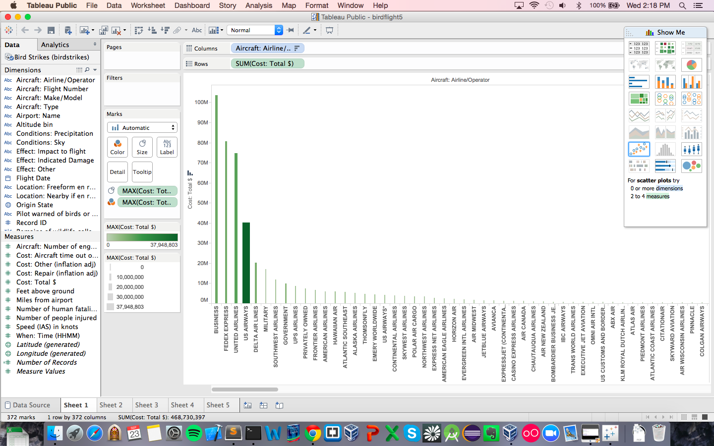
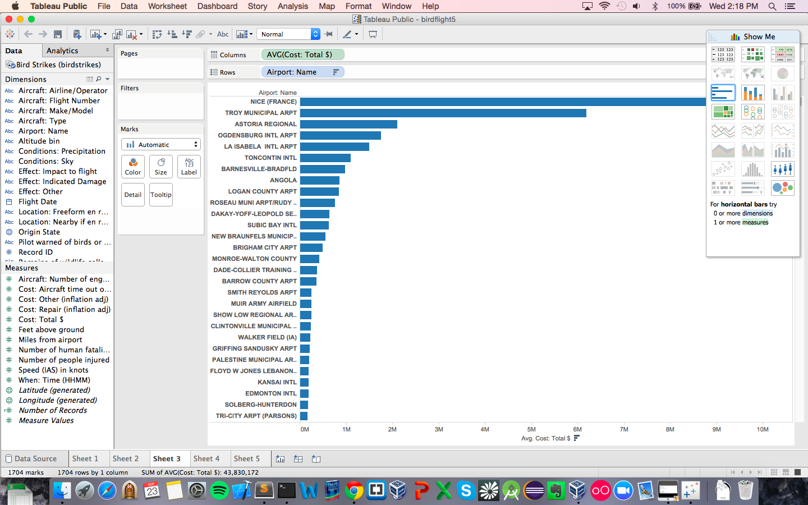
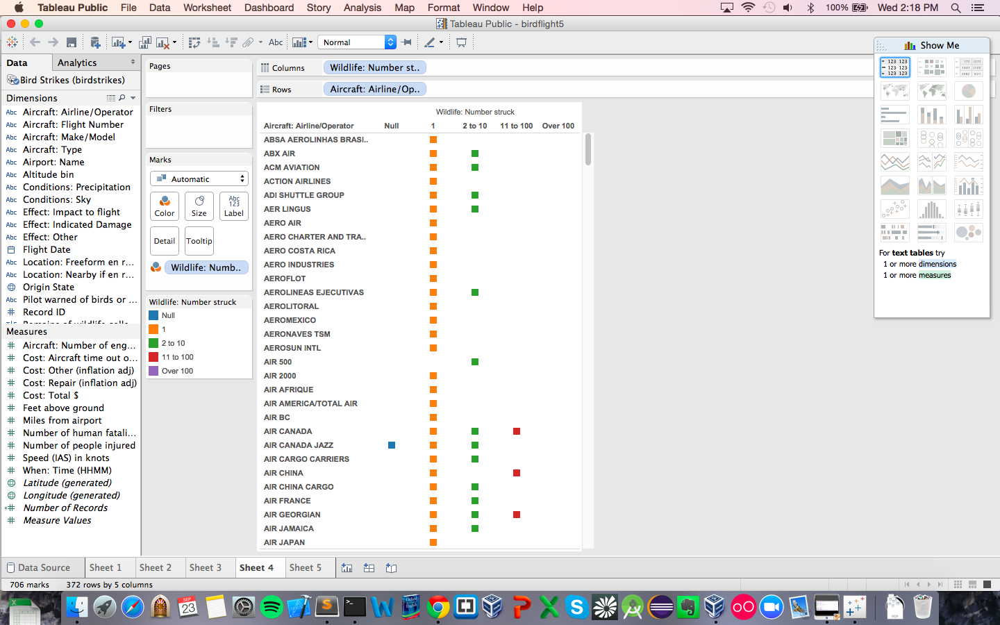
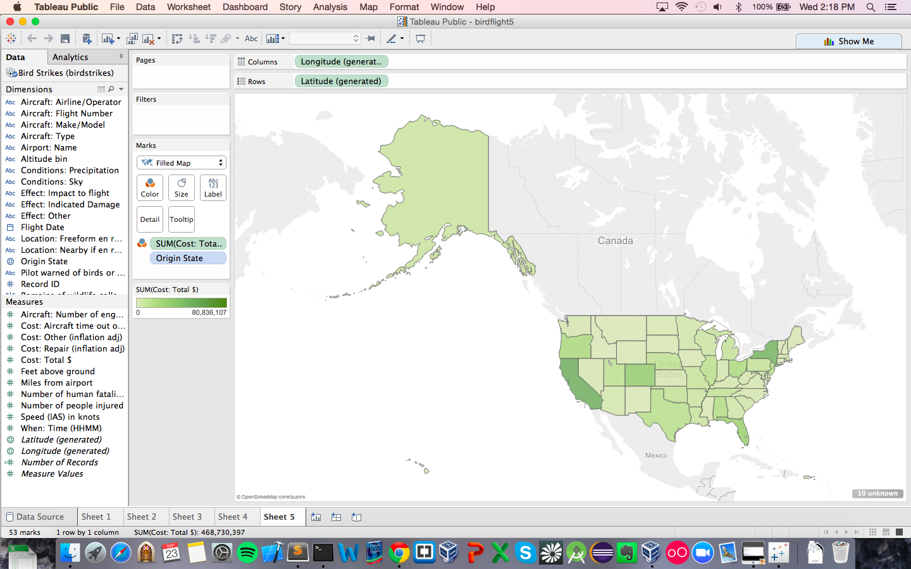

# Report

Using Tableau, create visualization for each question in the report regarding
bird strikes.

# Authors

This report is prepared by
* [fadhil fathurrahman suhendi](https://github.com/fadhilfath)
* [Zachary Lamb](https://github.com/ZachLamb)
* [Heather Witte](https://github.com/hswitte)
* [Kari Santos](https://github.com/karisantos)
* [Denis Kazakov](https://github.com/94kazakov)

# Which airlines have the worst luck with birdstrikes in terms of damage caused? 
This question was asked by (calebhsu).

# What is the most common flight phase where a birdstrike occurred?
This question was asked by (KevinKGifford).

# What airports have the most expensive average accident?

This question was asked by (satchelspencer ).

# Which plane strikes the most birds?

This question was asked by (twagar95).

# What state had the highest number of bird strikes? (Departure State)

This question was asked by (drewdinger).

  
