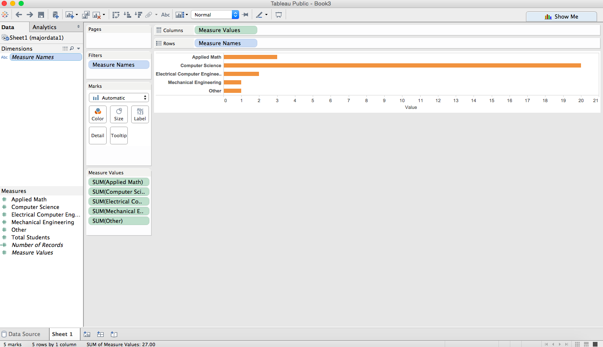
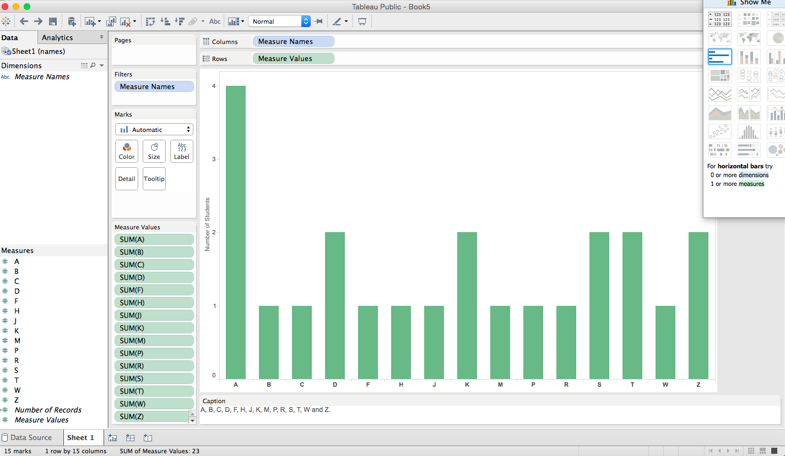
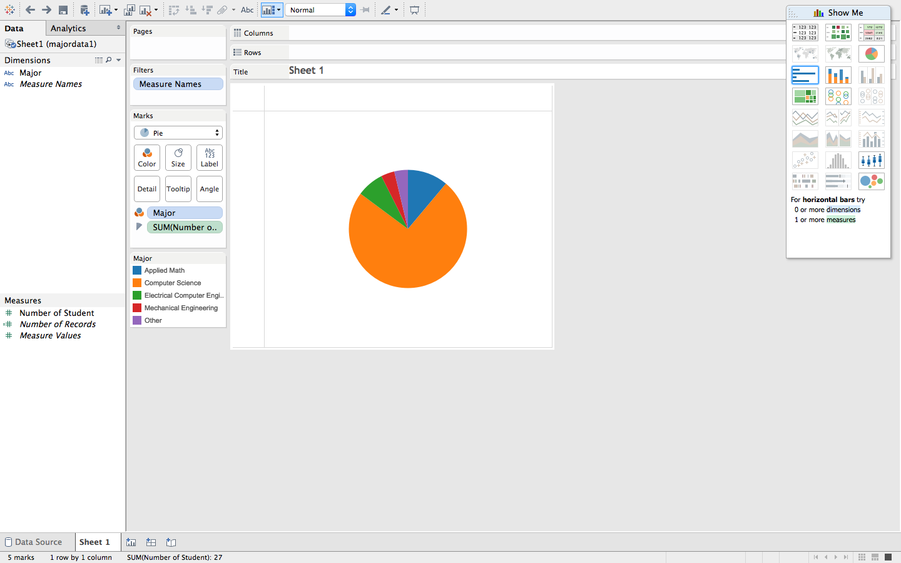
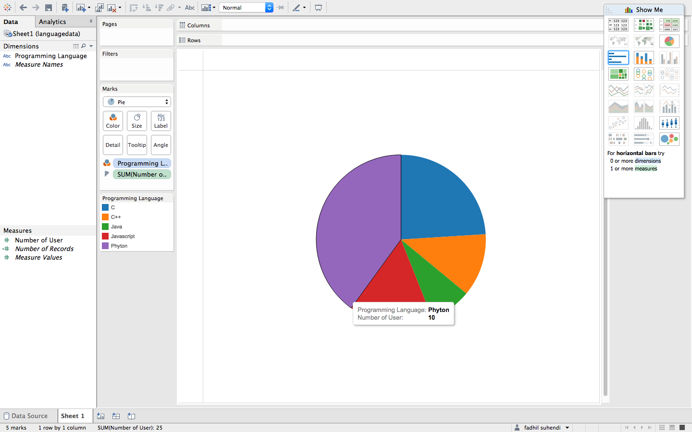

# Tableau Visualization

Tableau is arguably the biggest deal now in terms of data visualization for non-programmers.
Let's pretend you are not a programer. Learn and experience what it is like to make
visualizations using Tableau to answer the same questions about your classmates in our course.

For each of the question, think about what chart you should use to convey your answer and
make your best effort to create something that makes sense to you. There's no right
or wrong. When we meet in the class again, we will set aside time for each team to discuss
and compare the variety of visualization solutions each member has come up with for the
same set of questions. It will be fun!

To include a Tableau visualization in your report, take a screenshot, save it as an image,
put it in the `learning/week2` folder, and replace ``  with
your own image. Please makes sure your screenshot includes the _entire_ Tableau interface
including the controls, widgets ...etc.

# How big the deal Tableau really is?

Tableau is one of the most popular data visualization. Tableau changes the way we see our data. It can represents the data that is complex and hard to understand becoming the data that is more readable and makes sense. Also, Tableau has a good perfomance to build a beautiful graphical analysis very quick. 

# How many students are in Computer Science?

In this chart, I used a bar chart to represents the data. As you can see that the result is shown with the long bar where it represents the number of students who are taking Computer Science major.

# How many student's name start with 'A'?

In this chart, I also used a bar chart to represents data. And the bar represents the number of student's name with their first letter. And the tallest bar shows the highest number that represents student's name start with 'A'

# How many students are not in Computer Science?

For this data, I presents using pie chart. And the pie charts that are not in orange color represents the data of students who are not in Computer Science major

# Student's favorite programming language

For this data, I also presents using pie chart. Phyton with the purple color has the largest number of students who like python as their favorite programming language.