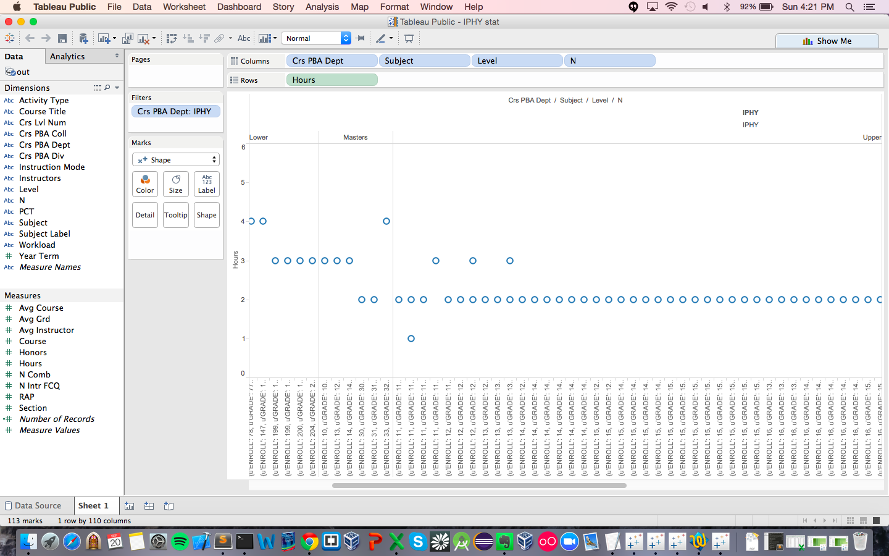
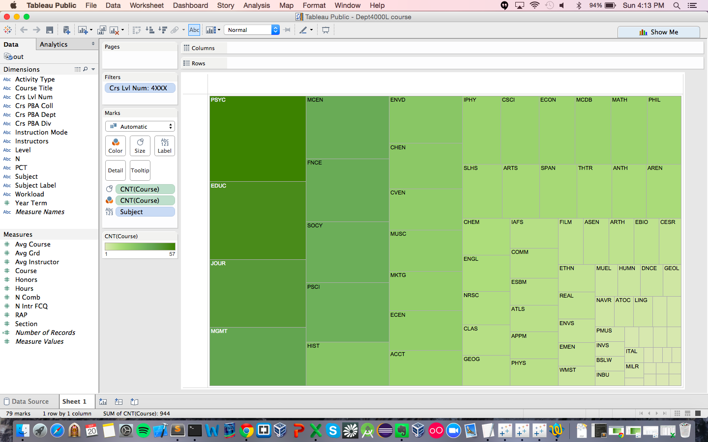
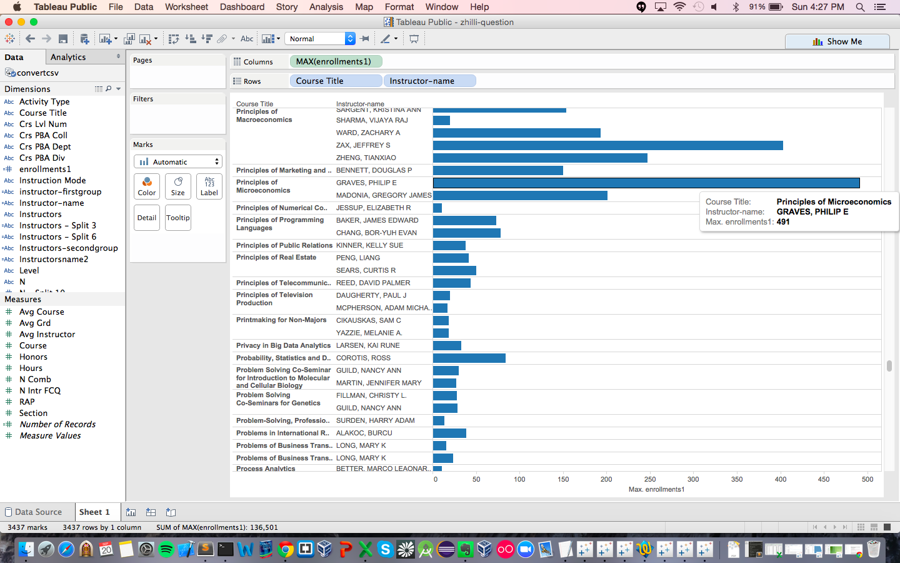
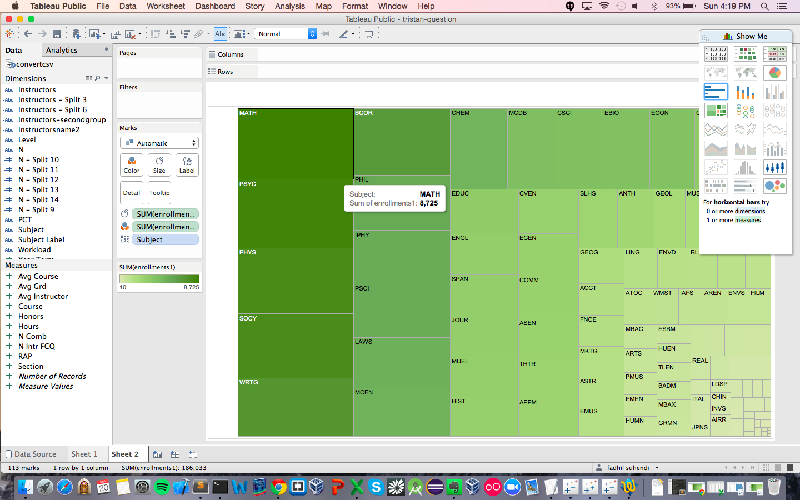
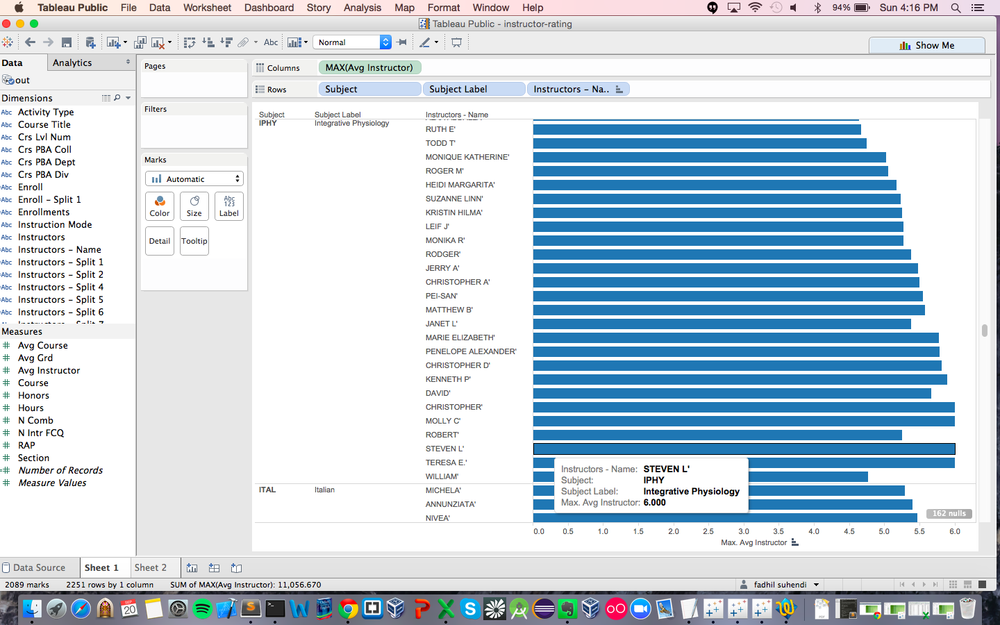

# Visualization

Using Tableau, create visualization for each question in the report. You will
work on this independently just like last week.

To include a Tableau visualization in your report, take a screenshot, save it as an image,
put it in the `learning/week2` folder, and replace ``  with
your own image. Please makes sure your screenshot includes the _entire_ Tableau interface
including the controls, widgets ...etc.

# Import

Data: [fcq.clean.json](https://github.com/bigdatahci2015/book/blob/master/hackathons/fcq/fcq.clean.json)

(a copy of this file is in your book repository already in the directory `hackathons/fcq`)

This dataset is provided to you in the JSON format. Your first task is to figure out
how to transform this JSON file into a format that can be fed into Tableau. As
a junior and senior, you are expected to be able to look around the Internet
to problem solve.

# How many courses in IPHY that have 4 credits hours ?

For this question, I used side by side circle view to display the total number of IPHY's courses that have 4 credits hour. The result is shown by the number of circle.

# What departments offer the most 4000 level classess? By Brian

For this question, I used treemaps to display the result. The treemaps will display the result by showing the box with the darkest green. The result is shown on the top left corner with the darkest color.

# Which instructor's course has the highest enrollment? By Zhilli

For this question, I used bar chart to display the instructor's course with the highest enrollment. The result is shown with the longest bar, which has 491 enrollments.

# Which department has the highest enrollment? By Tristan

For this question, I used treemaps to display department with the highest enrollment. From the graph above, the department with the highest enrollment is marked with the color dark green. 

# What instructors has the highest rating? By Andrew

I used a barchart to display the highest rating for instructor. The result can be seen from chart with long bar. In this visualization we have many instructors with the highest rating. However, in our report we just pick one which is STEVEN L. 
